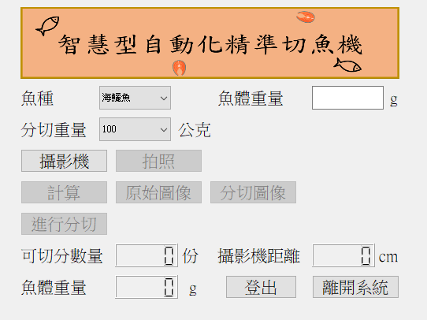

# fish_cutter
 yolov7, arduino, algorithm

##   套件版本

cudnn == 10.0 (7.6.5.32)

pyqt5 == 5.15.6
torch == 1.7.1+cu110
torchvision == 0.8.2+cu110
numpy == 1.21.2
opencv-python == 4.5.3.56
pandas == 1.3.5
matplotlib == 3.4.3
pillow == 8.3.2

##   使用流程
-   確定插入*D435i或L515*深度攝影機和*arduino*再進行開啟
-   以下開始程式步驟

main_test.py 為使用opencv的視窗來進行測試

>  按下s進行拍照
>>  按下s重新拍照，按下d進行yolov7辨識和演算法計算分切距離
>>>  按下d重新拍照，按下f進行arduino切魚

start.py 為適用使用者介面進行測試

